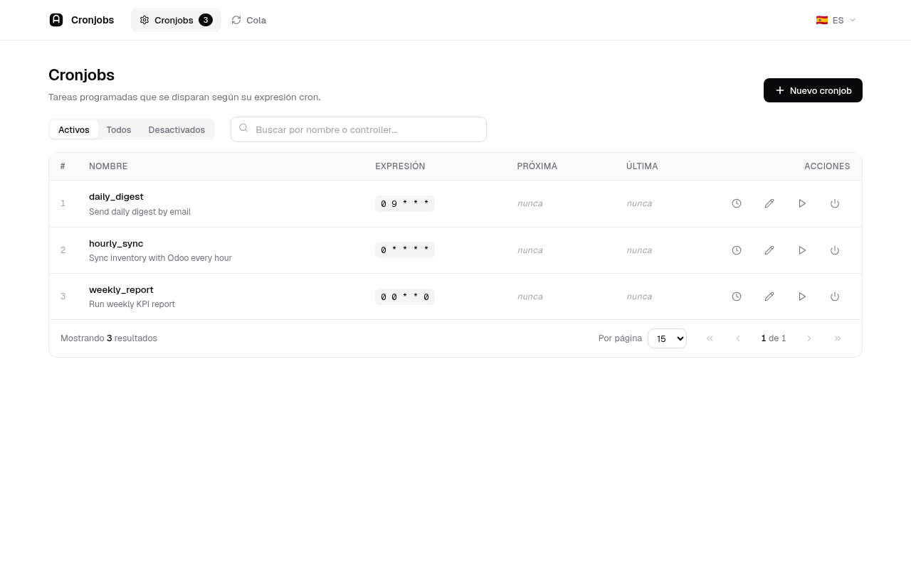
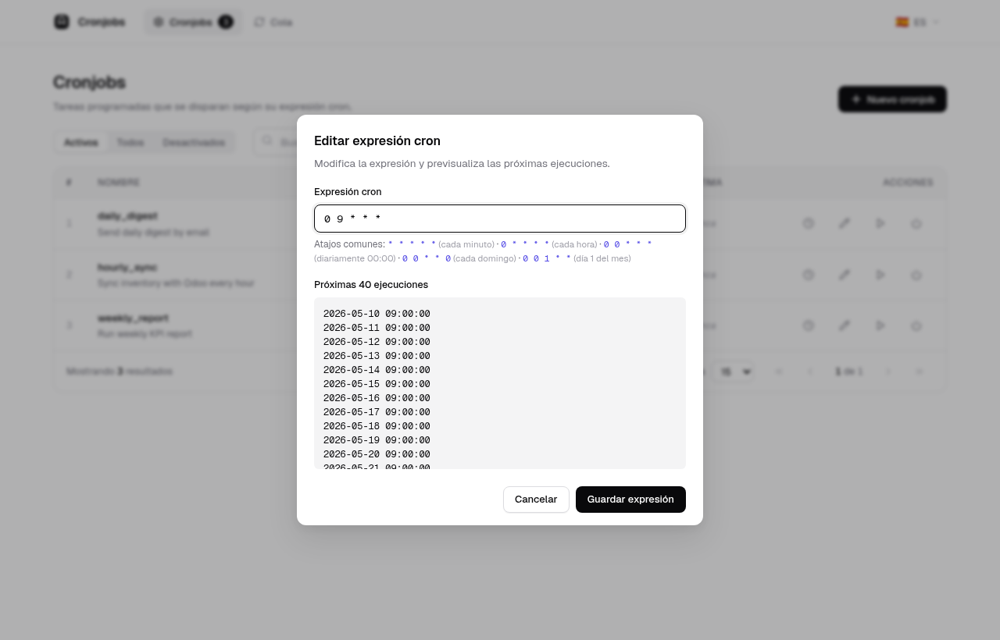
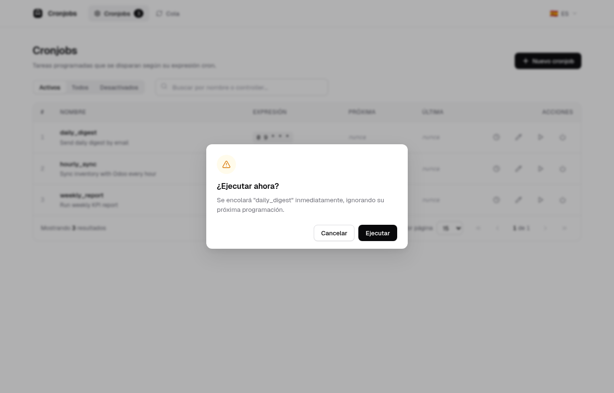

# Laravel Cronjobs

Database-driven cronjob manager for Laravel. Store jobs in MySQL, schedule each one with its own cron expression, retry/timeout policy, and dispatch them to the queue. Ships with a React admin UI.

## Requirements

- PHP `^8.3`
- Laravel `^13.0`
- A running `schedule:work` process (so pending jobs get dispatched every minute).
- A queue worker (`queue:work` / `queue:listen`) if you want jobs to actually run off the main process.

## Installation

```bash
composer require sefirosweb/laravel-cronjobs:^13.0
```

The service provider auto-registers via Laravel's package discovery.

Run migrations:

```bash
php artisan migrate
```

This creates the `cronjobs` table with fields for name, description, target controller/method, cron expression, backoff, max tries, timeout, retries, and soft-delete.

## Configuration

Publish the config:

```bash
php artisan vendor:publish --provider="Sefirosweb\LaravelCronjobs\LaravelCronjobsServiceProvider" --tag=config --force
```

Default `config/laravel-cronjobs.php`:

```php
return [
    'prefix'     => 'cronjobs',
    'middleware' => 'web',
];
```

> ⚠️ **Security**: the admin UI can dispatch *any* controller/method in your app. **Always** protect it with auth and an ACL check. If you use [`sefirosweb/laravel-access-list`](https://github.com/sefirosweb/laravel-access-list):
>
> ```php
> return [
>     'prefix'     => 'cronjobs',
>     'middleware' => ['web', 'auth', 'checkAcl:cronjobs_edit'],
> ];
> ```

Publish the React admin UI assets:

```bash
php artisan vendor:publish --provider="Sefirosweb\LaravelCronjobs\LaravelCronjobsServiceProvider" --tag=cronjobs-assets --force
```

## Admin UI

Since v13.0.1 the bundled admin UI is a self-contained React 19 + TypeScript + Vite SPA. There are no `react-bootstrap` / `react-crud` / `toastr` dependencies anymore — the bundle is ~115 kB gzipped including self-hosted Geist fonts. Tabs are hash-routed (`#cronjobs`, `#queue`).

| | |
|---|---|
| Cronjobs listing |  |
| Edit cron expression modal |  |
| Run-now confirmation |  |

The cron-expression modal calls `POST /preview_job` debounced on every keystroke and shows the next 40 firings of the expression, so the admin can validate the schedule before saving. A one-click cheat sheet of common patterns (`* * * * *`, `0 * * * *`, `0 0 * * *`, `0 0 * * 0`, `0 0 1 * *`) is right under the input.

The Disable / Enable toggle is optimistic: the row's `deleted_at` flips in cache immediately so the opacity, the "Desactivado" badge and the action buttons update without flicker, with rollback on error.

The *Activos / Todos / Desactivados* segmented filter at the top of the listing maps directly to `?status=` on `GET /cronjobs/crud`, so the trashed rows are reachable without a SQL detour.

## Usage

### 1. Keep the scheduler running

The service provider registers a `cronjobs:pending` command on Laravel's scheduler to run every minute. You need Laravel's own scheduler process alive:

```bash
php artisan schedule:work
```

…and a queue worker (recommended):

```bash
php artisan queue:work
```

### 2. Add and manage cronjobs from the UI

Browse to `/cronjobs` (or whatever prefix you configured). For each job you define:

| Field | Meaning |
|---|---|
| Name | Free text identifier (unique). |
| Description | Free text. |
| Controller | Fully qualified class, e.g. `App\Http\Controllers\Admin\ReportsController`. |
| Function | Public method with no required parameters. |
| Cron expression | Standard [cron syntax](https://en.wikipedia.org/wiki/Cron), e.g. `0 3 * * *`. The UI shows a preview of the next 40 runs. |
| Backoff | Seconds to wait before retrying after failure. |
| Max tries | Number of retry attempts before marking the job as failed. |
| Timeout | Seconds before the worker kills the job. |

### 3. Listen for events

Each dispatch emits an event that your app can react to:

```php
use Sefirosweb\LaravelCronjobs\Events\DispatchCronjobSuccessfully;
use Sefirosweb\LaravelCronjobs\Events\DispatchCronjobError;

Event::listen(DispatchCronjobSuccessfully::class, function ($e) {
    // $e->cronjob
});

Event::listen(DispatchCronjobError::class, function ($e) {
    // $e->cronjob, $e->error
});
```

### 4. Artisan commands

```bash
# List all cronjobs (active + trashed)
php artisan cronjobs:list

# Manually run a job by name
php artisan cronjobs:execute "Send invoices"

# Run all currently due jobs (this is what the scheduler calls internally)
php artisan cronjobs:pending
```

## Testing

```bash
composer install
./vendor/bin/phpunit
```

The suite uses Orchestra Testbench + SQLite `:memory:` and covers controller CRUD, the `DispatchCronjob` job, the `Cronjob` model (soft-deletes, casts), and the Carbon 3 `diffInSeconds` regression fix.

When working from the [laravel-test](https://github.com/sefirosweb/laravel-test) harness with Sail:

```bash
docker exec -w /var/www/html/packages/laravel-cronjobs laravel-test-laravel.test-1 ./vendor/bin/phpunit
```

## Versioning

Major versions are aligned with Laravel majors (`12.x`, `11.x`, `9.x` …). See the root [CLAUDE.md](https://github.com/sefirosweb/laravel-test/blob/12.0/CLAUDE.md) of the test harness for the full policy.

## License

MIT.
